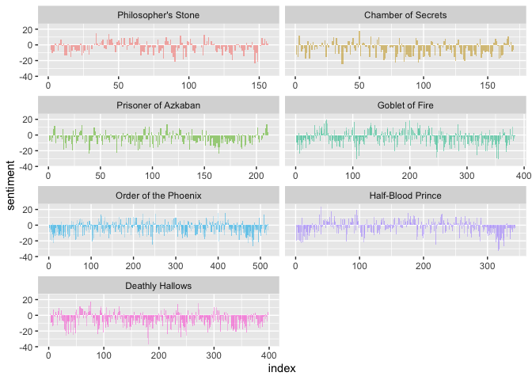
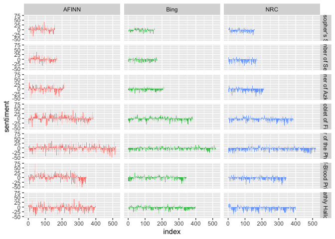

Harry Potter and the Analysis of Text Part 2
================
Maurisio Lombera
April 30, 2021

Introduction
------------

Previously we explored how to format text data into tidy text for basic analysis using J.K. Rowling's Harry Potter series in this [post](https://mlombera94.github.io/harry_potter_text_analysis/). Today we'll learn how to perform a more in depth sentiment analysis.

Sentiment analysis involves understanding the opinion or emotion within text. This is achieved by using lexicons. Lexicons are based on unigrams and contain English words that are each assigned a score for positive/negative sentiment as well as emotions such as joy, anger, sadness, etc.

This post will use three lexicons to determine sentiment/emotion of text. These include: `AFINN`, a lexicon that assigns words with a score between -5 and 5, with negative scores indicating negative sentiment and positive scores indicating positive sentiment. [`Bing`](https://www.cs.uic.edu/~liub/FBS/sentiment-analysis.html), a lexicon that categorizes words in a binary fashion into positive and negative categories. [`NRC`](http://saifmohammad.com/WebPages/NRC-Emotion-Lexicon.htm), a lexicon that also categorizes in a binary fashion into categories of positive, negative, anger, anticipation, disgust, fear, joy, sadness, suprise and trust.

Step 1: Download the Harry Potter series.
-----------------------------------------

``` r
if (packageVersion("devtools") < 1.6) {
  install.packages("devtools")
 }

devtools::install_github("bradleyboehmke/harrypotter", force = TRUE) # provides the first seven novels of the Harry Potter series
```

Step 2: Load the necessary packages
-----------------------------------

``` r
library(tidyverse)  # loads multiple useful packages  
library(harrypotter) # loads harry potter novels 
library(tidytext) # provides additional text mining functions
library(ggwordcloud) # provides a word cloud text geom for ggplot2
library(scales) # provides added functions for data visualization 
```

Step 3: Format, clean and tidy the text data
--------------------------------------------

It's important to remember text data should be properly formatted into a tidy format before starting any analysis, including sentiment analysis.

``` r
# store the title of each novel within a variable
titles <- c("Philosopher's Stone",
            "Chamber of Secrets",
            "Prisoner of Azkaban",
            "Goblet of Fire",
            "Order of the Phoenix",
            "Half-Blood Prince",
            "Deathly Hallows")

# all novels will be stored in a large tibble consisting of smaller tibbles for each novel, therefore, format as a list object to store a tibble for each novel
books <- list(philosophers_stone,
                chamber_of_secrets,
                prisoner_of_azkaban,
                goblet_of_fire,
                order_of_the_phoenix,
                half_blood_prince,
                deathly_hallows)


series <- tibble() # create an empty tibble to store the text data

# for loop to unnest and create a tidy text tibble for each novel
for(i in seq_along(titles)) {

  clean <- tibble(chapter = seq_along(books[[i]]),
                  text = books[[i]]) %>% # creates a tibble containing each chapter for each novel
                  unnest_tokens(word, text) %>% # unnests each word to create a 2 column table, with each row containing a single token (word/character) and the chapter it pertains to
                  mutate(book = titles[i]) %>% # adds a third column to identify which novel each token pertains to
                  select(book, everything()) # reorders the columns within the tibble with book as the first column

  series <- rbind(series, clean) # binds the tibble of each novel by rows  
}
```

Step 4: Sentiment Analysis
--------------------------

### Overall Sentiment

Once the text data has been cleaned and properly formatted, we can begin sentiment analysis with the `NRC` lexicon by using the `get_sentiments` function.

``` r
series %>% 
  right_join(get_sentiments("nrc")) %>% 
  filter(!is.na(sentiment)) %>% # removes tokens that had no sentiment attached 
  count(sentiment, sort = TRUE) # retrieves the total count of token for each sentiment 
```

    ## # A tibble: 10 x 2
    ##    sentiment        n
    ##    <chr>        <int>
    ##  1 negative     56579
    ##  2 positive     38324
    ##  3 sadness      35866
    ##  4 anger        32750
    ##  5 trust        23485
    ##  6 fear         21544
    ##  7 anticipation 21123
    ##  8 joy          14298
    ##  9 disgust      13381
    ## 10 surprise     12991

### Sentiment Analysis by indexed novel

Next, we can index each novel and create a table that tracks the sentiment as the novel progresses from start to finish. The first step involves indexing the novel, which in this case will be done by every 500 words. Once the novel is indexed, use the `Bing` lexicon and obtain the positive vs negative sentiment of each index.

``` r
bing_sentiment <- series %>% 
  group_by(book) %>% 
  mutate(word_count = 1:n(),
          index = word_count %/% 500 +1) %>% # index each novel by 500 tokens
  inner_join(get_sentiments("bing")) %>% 
  count(book, index = index, sentiment) %>% # count the total number positive/negative sentiment 
  ungroup() %>% 
  spread(sentiment, n, fill = 0) %>% # pivots the data and fills missing data with 0
  mutate(sentiment = positive - negative, 
         book = factor(book, levels = titles)) # creates a new variable, sentiment, which is the net count of positive and negative tokens
   
bing_sentiment %>% 
  top_n(-70, index) # limit to the first 10 index of each novel
```

    ## # A tibble: 70 x 5
    ##    book               index negative positive sentiment
    ##    <fct>              <dbl>    <dbl>    <dbl>     <dbl>
    ##  1 Chamber of Secrets     1       24       12       -12
    ##  2 Chamber of Secrets     2       25       10       -15
    ##  3 Chamber of Secrets     3       11       23        12
    ##  4 Chamber of Secrets     4       16       17         1
    ##  5 Chamber of Secrets     5       20       12        -8
    ##  6 Chamber of Secrets     6       18       13        -5
    ##  7 Chamber of Secrets     7       21       17        -4
    ##  8 Chamber of Secrets     8       28       11       -17
    ##  9 Chamber of Secrets     9       17        7       -10
    ## 10 Chamber of Secrets    10       18       23         5
    ## # … with 60 more rows

The table above shows each novel and it's index along with the total negative/positive sentiment contained within each index. These negative and positive sentiment scores are summed up to give us the overall sentiment for each index.

Lets repeat the process above using the other lexicons `Afinn` and `NRC`.

``` r
# Since the afinn lexicon assigns a sentiment value ranging from -5 to 5, we will simply just sum the sentiment value for each index as opposed to using a net difference used in the previous example. 
afinn <- series %>%
        group_by(book) %>% 
        mutate(word_count = 1:n(),
               index = word_count %/% 500 +1) %>% 
        inner_join(get_sentiments("afinn")) %>%
        group_by(book, index) %>%
        summarise(sentiment = sum(value)) %>% # sentiment variable is set up as a sum vs difference
        mutate(method = "AFINN")

# Since both bing and nrc use a binary classification of positive and negative, we can combine the code and bind the tables 
bing_and_nrc <- bind_rows(series %>%
                  group_by(book) %>% 
                  mutate(word_count = 1:n(),
                         index = word_count %/% 500 + 1) %>% 
                  inner_join(get_sentiments("bing")) %>%
                  mutate(method = "Bing"),
          series %>%
                  group_by(book) %>% 
                  mutate(word_count = 1:n(),
                         index = word_count %/% 500 + 1) %>%
                  inner_join(get_sentiments("nrc") %>%
                                     filter(sentiment %in% c("positive", "negative"))) %>%
                  mutate(method = "NRC")) %>%
        count(book, method, index = index , sentiment) %>%
        ungroup() %>%
        spread(sentiment, n, fill = 0) %>%
        mutate(sentiment = positive - negative) %>%
        select(book, index, method, sentiment)

combined_lexicons <- bind_rows(afinn, 
                               bing_and_nrc) %>% # bind all three tables 
  ungroup() %>%
  mutate(book = factor(book, levels = titles)) 

combined_lexicons %>% 
  top_n(-3, index) %>% 
  arrange(book)
```

    ## # A tibble: 21 x 4
    ##    book                index sentiment method
    ##    <fct>               <dbl>     <dbl> <chr> 
    ##  1 Philosopher's Stone     1        11 AFINN 
    ##  2 Philosopher's Stone     1         0 Bing  
    ##  3 Philosopher's Stone     1         3 NRC   
    ##  4 Chamber of Secrets      1       -14 AFINN 
    ##  5 Chamber of Secrets      1       -12 Bing  
    ##  6 Chamber of Secrets      1       -19 NRC   
    ##  7 Prisoner of Azkaban     1        -7 AFINN 
    ##  8 Prisoner of Azkaban     1        -7 Bing  
    ##  9 Prisoner of Azkaban     1       -11 NRC   
    ## 10 Goblet of Fire          1       -22 AFINN 
    ## # … with 11 more rows

Similar to the previous table, we are able to see the overall summed sentiment for each index within each novel and its respective lexicon method used.

Step 5: Visualizing Sentiment Analysis
--------------------------------------

Let's take it a step further and visualize the sentiment of each novel as it progresses. Using the `Bing` lexicon and the table we created earlier, we can graph the sentiment on the Y-axis, the index on the X-axis and then facet the graph so each novel has its own visualization for easy comparison.

``` r
bing_sentiment %>% 
  ggplot(aes(index, sentiment, fill = book)) + 
    geom_bar(alpha = 0.5, stat = "identity", show.legend = FALSE) +
    facet_wrap(~ book, ncol = 2, scales = "free_x") # splits the graphs by novel 
```



Based on the visualization from the graphs above, we can easily see how each novel's sentiment changes as the story progresses. For example, Half-Blood Prince starts with a considerable amount of negative sentiment. Surprisingly, towards the finale of the series in Deathly Hallows, the sentiment remains negative.

For better comparison among each of the lexicons, we can visualize the sentiment similarly above with a slight tweak and facet the graphs by both lexicon and novel.

``` r
combined_lexicons %>% 
  ggplot(aes(index, sentiment, fill = method)) +
  geom_bar(alpha = 0.8, stat = "identity", show.legend = FALSE) + 
  facet_grid(book ~ method) # split the graphs by each lexicon and by book
```



Based on the above results, similar peaks and dips in sentiment occur across each of the lexicons with differences on the magnitude of sentiment; the `AFINN` lexicon tends to have higher degrees of both positive and negative sentiment compared to both `Bing` and `NRC`.
